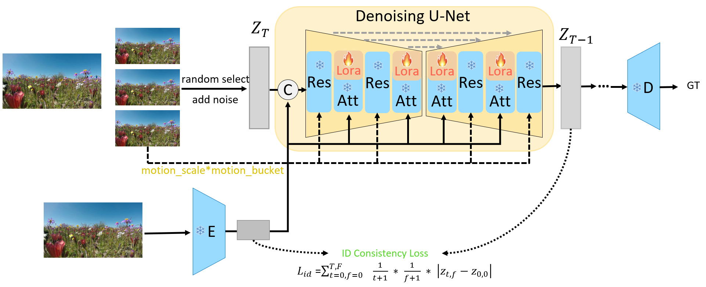

<div align="center">
<h1>MotionLora</h1>

<!--Paper: ([arXiv:2405.14174](https://arxiv.org/abs/2405.14174))-->
</div>

## Introduction
MotionLora is a light-weight lora to control the camera motion of the generated videos for SVD. 

<p align="center">
  
</p>

## Quick Start


To train a motionlora for a specific motion patern, use the following commands:

```bash
CUDA_VISIBLE_DEVICES="0,1" accelerate launch train_svd.py \
    --base_folder='xxx' \
    --pretrained_model_name_or_path=/path/to/weight \
    --per_gpu_batch_size=1 --gradient_accumulation_steps=1 \
    --max_train_steps=50000 \
    --num_frames=14 \
    --width=512 \
    --height=320 \
    --checkpointing_steps=1000 --checkpoints_total_limit=1 \
    --learning_rate=1e-5 --lr_warmup_steps=0 \
    --seed=123 \
    --mixed_precision="fp16" \
    --validation_steps=500 \
    --output_dir='/path/to/save'
```

To adapt MotionLora to SVD, use the following commands:

```bash
python test_svd_lora.py
```

## Acknowledgment

This project is based on Stable Video Diffusion([paper](https://arxiv.org/abs/2311.15127), [code](https://github.com/Stability-AI/generative-models)), SVD_Xtend([code](https://github.com/pixeli99/SVD_Xtend)),
 thanks for their excellent works.